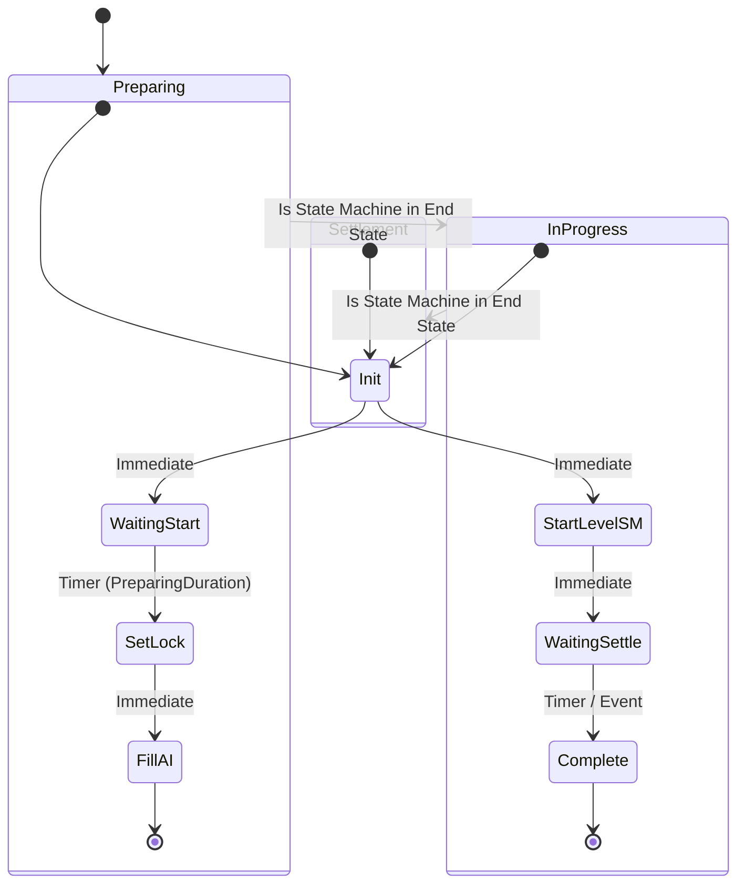

# SM_LevelFlow_Main (Logic Driver State Machine)

> [!NOTE]
> **状态**: ✅ 已实现

**职责**：关卡主流程状态管理
**上下文 Actor 类 (Context)**：`GS_Core`
**父类**：`SMInstance`

## 状态机结构

## 变量定义

| 变量名 | 类型 | 说明 |
|--------|------|------|
| Context | `GS_Core` | 自动获取的 Owner Actor |

## 状态详细配置

### 1. Preparing 状态 (Sub-State Machine) ✅

> [!NOTE]
> Preparing 是一个 **State Machine 节点**（不是普通 State），双击进入内部状态图。
> On State Begin 逻辑写在内部的 **Init** 子状态中。

#### 1.1 子状态: Init
- **On State Begin**:
    - 设置 `Context.ActiveMatchPhase = Match.Phase.Main.Preparing`（通过变量设置节点）
- **属性配置**:
    - `Eval Transitions on Start = true`
    - `Can be End State = false`
- **Transitions**:
    - **Condition**: Immediate (`Can Enter Transition = true`)
    - **Target**: `WaitingStart`

#### 1.2 子状态: WaitingStart
- **On State Begin**: 无逻辑（纯等待状态）
- **Transitions**:
    - **Condition**: `Time in State >= Context.PreparingDuration`
    - **Target**: `SetLock`

#### 1.3 子状态: SetLock
- **On State Begin**:
    - 调用 `Context.ActiveMatchStatus.AddGameplayTag(Match.Status.Locked)`
- **属性配置**:
    - `Eval Transitions on Start = true`
    - `Can be End State = false`
- **Transitions**:
    - **Condition**: Immediate (`Can Enter Transition = true`)
    - **Target**: `FillAI`

#### 1.4 子状态: FillAI (End State)
- **On State Begin**:
    - `GetGameMode` → `Cast to GM_Core` → `FillAIPlayers()`
- **属性配置**:
    - `Can be End State = true` ⚠️ **重要**
- **Transitions**: 无（End State）

---

### 2. InProgress 状态 (Sub-State Machine) ✅

> [!NOTE]
> InProgress 也是一个 **State Machine 节点**，on State Begin 逻辑写在内部的 **Init** 子状态中。

#### 2.1 子状态: Init
- **On State Begin**:
    - 设置 `Context.ActiveMatchPhase = Match.Phase.Main.InProgress`
- **属性配置**:
    - `Eval Transitions on Start = true`
    - `Can be End State = false`
- **Transitions**: Immediate → `StartLevelSM`

#### 2.2 子状态: StartLevelSM
- **On State Begin**:
    - `GetGameMode` → `Cast to GM_Core` → 获取 `LevelSubSM`
    - `GS Core` → 获取 `LevelSubSM` 组件
    - 如果类有效:
        - 调用 `LevelSubSM 组件.SetStateMachineClass(LevelSubSM 变量)`
        - 调用 `LevelSubSM 组件.Initialize()`
        - 调用 `LevelSubSM 组件.Start()`
- **属性配置**:
    - `Eval Transitions on Start = true`
    - `Can be End State = false`
- **Transitions**: Immediate → `WaitingSettle`

#### 2.3 子状态: WaitingSettle ✅

- **On State Begin**: 无逻辑（纯等待状态）
- **属性配置**:
    - `Can be End State = false`
- **Transitions**:
    - **转换 A (Timer)**: → Complete
      - 条件：`Time in State >= Context.InProgressDuration`
      - Priority: 1
    - **转换 B (事件)**: → Complete
      - 自动事件绑定：Context / GS_Core / OnLevelShouldEnd
      - Priority: 0

#### 2.4 子状态: Complete ✅

- **On State Begin**: 无逻辑
- **属性配置**:
    - `Can be End State = true`
- **Transitions**: 无（End State）

---

### 3. Settlement 状态 (Sub-State Machine) ✅

> [!NOTE]
> Settlement 也是一个 **State Machine 节点**，On State Begin 逻辑写在内部的 **Init** 子状态中。

#### 3.1 子状态: Init
- **On State Begin**:
    - 设置 `Context.ActiveMatchPhase = Match.Phase.Main.Settlement`
    - 调用 `Context.OnLevelShouldEnd.Broadcast()` ← 停止 LevelSubSM
    - 打印日志: `"[MainSM] Settlement.Init"`
- **属性配置**:
    - `Can be End State = false` (后续会添加更多结算逻辑)

---

## 转换规则 (Transitions)

### Preparing -> InProgress
- **Source**: Preparing State (End)
- **Target**: InProgress State
- **Trigger**: Automatic when `Preparing` sub-graph completes.

### InProgress -> Settlement
- **Source**: InProgress State (End)
- **Target**: Settlement State
- **Trigger**: Automatic when `InProgress` sub-graph completes (Timer 到期 or 事件触发).

## 网络配置 (SMStateMachineComponent)

所有逻辑仅在 **Server** 运行，客户端通过 `GS_Core` 的 Replicated Variables 更新感知状态。

| 属性 | 设置 |
|------|------|
| Component Replicates | ✅ True |
| State Change Authority | Server |
| Network Tick Configuration | Server |
| Network State Execution | Server |
| Include Simulated Proxies | ✅ True |
