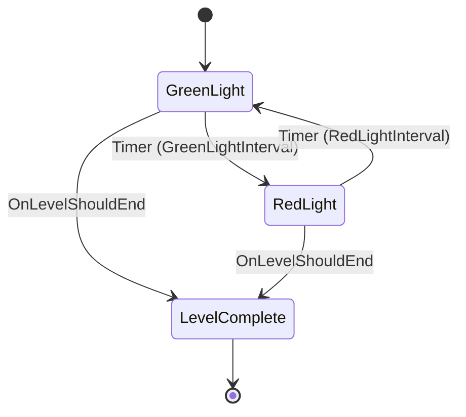

# SM_Endurance ([Logic Driver State Machine](../../../参考文档/Plugins/Logic Driver Lite API 参考.md))

> [!NOTE]
> **状态**: ✅ 已实现

**职责**：关卡1 耐力之匣（红绿灯）逻辑控制
**上下文 Actor 类 (Context)**：`GS_Endurance`
**父类**：`SMInstance`

## 状态机结构

## 变量定义

| 变量名 | 类型 | 说明 |
|--------|------|------|
| Context | `GS_Endurance` | 自动获取的 Owner Actor |

## 状态详细配置

### 1. GreenLight 状态

**On State Begin**:
- 使用通知设置 `Context.IsRedLight = false`
- 打印日志: `"[SM_Endurance] 绿灯 (行)"`

**Transitions**:
- **Source**: GreenLight
- **Target**: RedLight
- **Trigger**: Timer (Seconds)
- **Duration**: `Context.GreenLightInterval`

### 2. RedLight 状态

**On State Begin**:
- 使用通知设置 `Context.IsRedLight = true`
- 打印日志: `"[SM_Endurance] 红灯 (停)"`

**Transitions**:
- **Source**: RedLight
- **Target**: GreenLight
- **Trigger**: Timer (Seconds)
- **Duration**: `Context.RedLightInterval`

### 3. LevelComplete 状态 (End State)

**On State Begin**:
- 打印日志: `"[SM_Endurance] 已停止"`

**属性配置**:
- `Can be End State = true`

**Transitions (入向)**:
- **Source**: GreenLight / RedLight
- **Target**: LevelComplete
- **Trigger**: 事件 (`OnLevelShouldEnd`)
- **Priority**: 0

## 网络配置 (SMStateMachineComponent)

所有逻辑仅在 **Server** 运行，通过 `GS_Endurance` 的 `IsRedLight` (RepNotify) 变量同步给客户端。

| 属性 | 设置 |
|------|------|
| Component Replicates | ✅ True |
| State Change Authority | Server |
| Network Tick Configuration | Server |
| Network State Execution | Server |
| Include Simulated Proxies | ✅ True |

## 组件挂载说明

`SM_Endurance` 将作为运行时实例逻辑，运行在 `GS_Core`（及其子类 `GS_Endurance`）上的 `LevelSubSM` 组件中。

1. **Host Component**: `GS_Core.LevelSubSM` (SMStateMachineComponent)
2. **Initialization**: 由 `SM_LevelFlow_Main` 的 `InProgress` -> `StartLevelSM` 状态负责加载类并启动。
