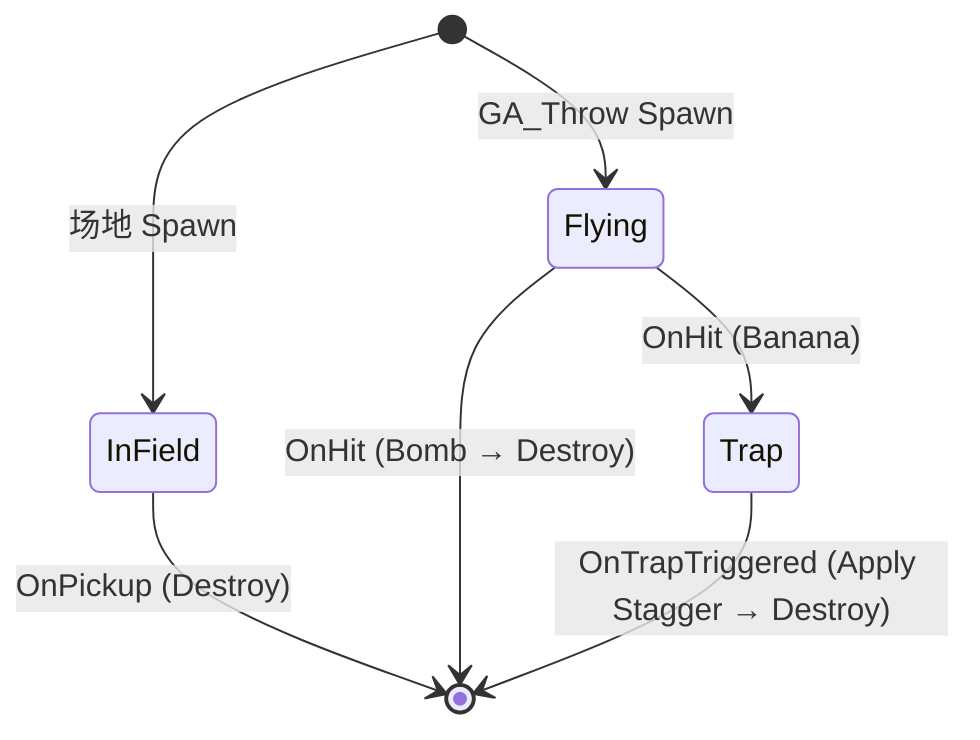

# BP_Item_Base（道具基类）

> 所有道具的基类，定义通用结构、状态机和接口。

**路径**：`Content/0_/Blueprints/Items/BP_Item_Base`

**父类**：Actor

---

## 组件结构

```
BP_Item_Base (Actor)
├── Root (Scene Component) ← 根组件
├── ShowMesh (Static Mesh) ← 场地状态展示模型
├── PropMesh (Static Mesh) ← 手持状态小模型（默认隐藏）
├── DetectionBox (Sphere Collision, R=200) ← 高亮提示触发
├── InteractBox (Sphere Collision, R=50) ← 交互触发（拾取/陷阱）
└── StateMachineComponent (SMInstance) ← Logic Driver Lite 状态机
```

### 组件配置

| 组件 | 关键设置 |
|------|----------|
| **ShowMesh** | 默认可见；无碰撞（检测由 Box 负责） |
| **PropMesh** | 默认隐藏（Hidden in Game = true）；无碰撞 |
| **DetectionBox** | Collision Profile = OverlapOnlyPawn；Radius = 200 |
| **InteractBox** | Collision Profile = OverlapOnlyPawn；Radius = 50 |
| **StateMachineComponent** | **Start on Begin Play = ✅**；Component Replicates = ✅ |

### Actor 复制设置（Class Defaults → Replication）

| 属性 | 值 | 说明 |
|------|:---:|------|
| **Replicates** | ✅ | 服务端销毁同步到客户端 |
| **Net Load on Client** | ✅ | 客户端加载地图时创建（避免 ItemID 空值报错） |
| **Replicate Movement** | ✅ | Flying 状态需要 |
| **Net Update Frequency** | 100 | 网络更新频率 |

> [!NOTE]
> **Net Load on Client** 仅对关卡中预放置的 Actor 有效。PCG 运行时生成的 Actor 无需此选项，仅依赖 Replicates。

---

## 变量 ✅

| 变量名 | 类型 | 复制 | 默认值 | 说明 |
|--------|------|:----:|--------|------|
| ItemID | Data Table Row Handle | ✅ | None | 核心数据源，指定道具 ID（RepNotify） |
| ItemData | S_ItemData | ❌ | Structure | 运行时缓存的数据（查表得来） |

### 构造脚本 (Construction Script) ✅

```
Get Data Table Row (DT_ItemData, RowName=ItemID)
    ↓
SET ItemData
    ↓
ShowMesh.SetStaticMesh(ItemData.ShowMesh)
PropMesh.SetStaticMesh(ItemData.PropMesh)  ← 可能为 None
```

### OnRep_ItemID ✅

```
Get Data Table Row (DT_ItemData, RowName=ItemID)
    ↓
SET ItemData
    ↓
ShowMesh.SetStaticMesh(ItemData.ShowMesh)
PropMesh.SetStaticMesh(ItemData.PropMesh)
```

### EItemType 枚举 ✅

在 `Content/0_/Blueprints/Enums/` 创建：

| 值 | 说明 |
|----|------|
| Throwable | 投掷类道具 |
| Buff | Buff 类道具 |
| Resource | 资源类道具 |

---

## Event Dispatchers（事件分发器）✅

| 名称 | 参数 | 用途 | 实现状态 |
|------|------|------|:--------:|
| `OnPickedUp` | - | InField → Destroy（存储 ItemID 到角色） | ✅ |
| `OnItemHit` | Actor OtherActor | Flying → Trap/Destroy | ✅ |
| `OnTrapTriggered` | Actor OtherActor | Trap 状态触碰角色 → Apply Stagger | ✅ |

---

## 函数 ✅

### 函数总览

| 名称 | 权限 | 说明 | 状态 |
|------|------|------|:----:|
| `OnRep_ItemID` | Client | 客户端收到 ID 后查表更新 ItemData 和模型 | ✅ |
| `OnPickup` | Server | 拾取逻辑（存 ItemID 到角色，Destroy） | ✅ |
| `HandleThrowablePickUp` | Server | Throwable 分支处理 | ✅ |
| `HandleBuffPickUp` | Server | Buff 分支处理（GiveAbilityAndActivateOnce） | ✅ |
| `HandleResourcePickUp` | Server | Resource 分支处理 | ✅ |
| `SetHighlight` | Any | 高亮控制（Stencil Value = 1） | ✅ |
| `OnTrap` | Server | **虚函数**，陷阱触发逻辑（子类重写） | ✅ |
| `InitItem` | Any | 查表初始化（ConstructionScript/OnRep 共用） | ✅ |

### OnPickup ✅

**输入**：`NewOwner` (BP_Character_Game)
**权限**：Server（Switch Has Authority）

```
OnPickup(NewOwner)
    ↓
Switch Has Authority
    ↓ Authority
Switch on ItemData.ItemType
    │
    ├─ Throwable → HandleThrowablePickUp(NewOwner)
    ├─ Buff → HandleBuffPickUp(NewOwner)
    └─ Resource → HandleResourcePickUp(NewOwner)

HandleThrowablePickUp:
    → GetComponentByClass(Comp_Character_Endurance)
    → SetThrowItemID(Self.ItemID)
    → Call OnPickedUp → DestroyActor

HandleBuff/ResourcePickUp:
    → GetAbilitySystemComponent(NewOwner)
    → GiveAbilityAndActivateOnce(ItemData.ItemAbility)
    → Call OnPickedUp → DestroyActor
```


### SetHighlight ✅

**输入**：`IsHighlight` (Bool)

```
SetHighlight(IsHighlight)
    ↓
ShowMesh.SetRenderCustomDepth(IsHighlight)
ShowMesh.SetCustomDepthStencilValue(1)  ← 物品统一使用 Stencil Value = 1
```

> [!NOTE]
> **Stencil Value 约定**：1 = 物品高亮。配合 OutlineMaker 插件的 Post Process Volume 使用。

---

## 状态机 (Logic Driver Lite)

### 状态机资产

在 `Content/0_/Blueprints/Items/` 创建状态机蓝图：`SM_Item`

### 状态定义（3 状态）

> [!IMPORTANT]
> **无 Held 状态**：拾取后 BP_Item 销毁，只存储 ItemID 到角色组件。瞄准时由 GA_Aim 直接显示 PropMesh，投掷时 Spawn 新 BP_Item（初始状态 = Flying）。

| 状态 | 使用场景 | On Begin | On Hit/Overlap |
|------|----------|----------|----------------|
| **InField** | 场地道具 | ShowMesh 可见，检测框启用 | 拾取 → Destroy |
| **Flying** | 投掷中 | PropMesh 物理模拟，InteractBox 检测 | OnHit 虚函数 |
| **Trap** | Banana 陷阱 | ShowMesh 可见，检测框启用 | 触碰 → Apply Stagger → Destroy |

### 状态转换



### InField 状态实现 ✅

**On State Begin**：
```
ShowMesh.SetVisibility(true)
PropMesh.SetVisibility(false)
DetectionBox.SetCollisionEnabled(QueryOnly)
InteractBox.SetCollisionEnabled(QueryOnly)
Bind Event to OnComponentBeginOverlap (InteractBox) → HandleInFieldOverlap
```

**HandleInFieldOverlap**：
```
Cast OtherActor to BP_Character_Game
    ├─ 成功 → OnPickUp(Character)
    └─ 失败 → 忽略
```

**On State End**：
```
InteractBox → Unbind All Events from OnComponentBeginOverlap
```

### Flying 状态实现 ✅

> [!NOTE]
> - PropMesh 只做展示和物理模拟，不做碰撞
> - InteractBox 负责碰撞检测，触发 OnHit 虚函数

**On State Begin**：
```
ShowMesh.SetVisibility(false)
PropMesh.SetVisibility(true)
PropMesh.SetSimulatePhysics(true)
DetectionBox.SetCollisionEnabled(NoCollision)
InteractBox.SetCollisionEnabled(QueryOnly)

Bind Event to OnComponentBeginOverlap (InteractBox)
    → HandleFlyOverlap
```

**HandleFlyOverlap**：
```
HandleFlyOverlap(OtherActor)
    ↓
OnHit(ContextItem, OtherActor)  ← 虚函数，子类重写
```

**On State End**：
```
InteractBox → Unbind All Events from OnComponentBeginOverlap
```

### Trap 状态实现 ✅

**On State Begin**：
```
ShowMesh.SetSimulatePhysics(false)
ShowMesh.SetVisibility(true)
DetectionBox.SetCollisionEnabled(NoCollision)  ← Trap 不需要高亮
InteractBox.SetCollisionEnabled(QueryOnly)
Bind Event to OnComponentBeginOverlap (InteractBox) → HandleTrapOverlap
```

**HandleTrapOverlap**：
```
Cast OtherActor to BP_Character_Game
    ├─ 成功 → OnTrap(Character)  ← 虚函数，子类重写
    └─ 失败 → 忽略
```

**On State End**：
```
InteractBox → Unbind All Events from OnComponentBeginOverlap
```

### OnTrap 虚函数 ✅

**位置**：BP_Item_Base 函数
**输入**：TrappedCharacter (BP_Character_Game)
**权限**：Server（Has Authority 检查在函数内）

```
OnTrap(TrappedCharacter)
    ↓
【基类空实现，子类重写】

子类示例 (BP_Item_Banana):
    Switch Has Authority
        └─ Authority ↓
    Call OnTrapTriggered(TrappedCharacter)
    Send Gameplay Event (Gameplay.Event.Activate.Stagger)
    Destroy Actor
```

---

## 双框检测实现 ✅

### DetectionBox - OnBeginOverlap

```
Bound Event OnComponentBeginOverlap (DetectionBox)
    ↓
Cast OtherActor to BP_Character_Game
    ├─ 失败 → 忽略
    └─ 成功 ↓
Is Locally Controlled?  ← 只对本地玩家显示高亮
    ├─ False → 返回
    └─ True → SetHighlight(true)
```

### DetectionBox - OnEndOverlap

```
Bound Event OnComponentEndOverlap (DetectionBox)
    ↓
Cast OtherActor to BP_Character_Game
    ├─ 失败 → 忽略
    └─ 成功 ↓
Is Locally Controlled?
    ├─ False → 返回
    └─ True → SetHighlight(false)
```


> [!NOTE]
> **InteractBox 状态分发**：InteractBox 的 Overlap 处理由状态机在各状态内部绑定/解绑。InField 状态触发 OnPickUp，Trap 状态触发 OnTrap。

---

## 实现状态

| 功能 | 状态 |
|------|:----:|
| 组件结构 | ✅ |
| EItemType 枚举 | ✅ |
| S_ItemData 结构体 | ✅ |
| DT_ItemData 数据表 | ⏳ (Mesh ✅ / Icon ❌ / ItemAbility ❌) |
| 变量定义（ItemID/ItemData） | ✅ |
| Construction Script | ✅ |
| OnRep_ItemID / InitItem | ✅ |
| Event Dispatchers | ✅ |
| SMStateMachineComponent | ✅ |
| SM_Item InField 状态 | ✅ |
| SM_Item Trap 状态 | ✅ |
| SM_Item Flying 状态 | ✅ 主要逻辑已完成，未测试 |
| 双框检测 | ✅ |
| 网络复制测试 | ❌ |

---

## 相关文档

- [道具系统.md](../道具系统.md)
- [总体策划.md](../总体策划.md)
