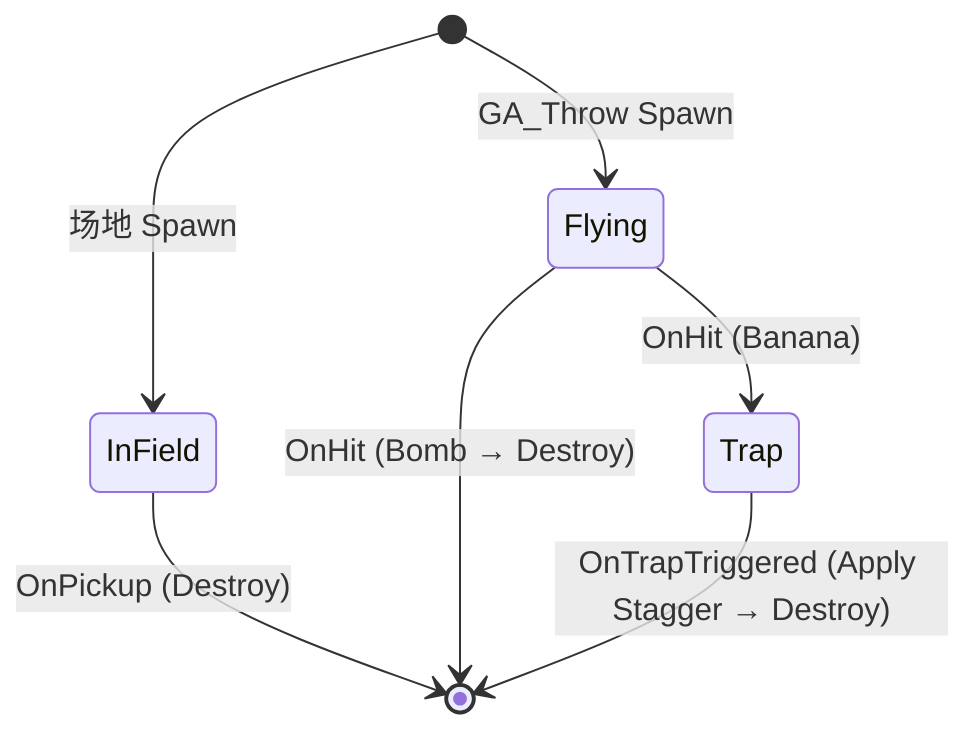

# BP_Item_Base（道具基类）

> 所有道具的基类，定义通用结构、状态机和接口。

**路径**：`Content/0_/Blueprints/Items/BP_Item_Base`

**父类**：Actor

---

## 组件结构

```
BP_Item_Base (Actor)
├── Scene (Scene Component) ← 根组件
├── ShowMesh (Static Mesh) ← 场地展示模型 (NoCollision)
├── PropMesh (Static Mesh) ← 手持投掷模型 (NoCollision, 初始 HiddenInGame=false, Visibility=false)
├── DetectionBox (Sphere Collision, R=200)
├── InteractBox (Sphere Collision, R=50)
├── StateMachineComponent (SMInstance)
└── ProjectileMovement (PMC) ← Flying 状态运动控制
```

### 组件配置

| 组件 | 关键设置 |
|------|----------|
| **ShowMesh** | 默认可见；无碰撞（检测由 Box 负责） |
| **PropMesh** | Hidden in Game = false；通过 Set Visibility 控制显隐；无碰撞 |
| **DetectionBox** | Collision Profile = OverlapAllDynamic；Radius = 200 |
| **InteractBox** | Collision Profile = OverlapAllDynamic；Radius = 50 |

> [!NOTE]
> **OverlapAllDynamic 预设需修改**：需对 `PawnBlock` 和 `PuppetVision` 通道响应 Overlap，详见 [BP_StartLine.md](../场景/功能组件/BP_StartLine.md)。
| **StateMachineComponent** | 见下方详细配置 |

### StateMachineComponent 配置 ✅

**位置**：BP_Item_Base → Components → StateMachineComponent → Details 面板

| 属性 | 设置 | 说明 |
|------|:----:|------|
| State Machine Class | SM_Item | 道具状态机 |
| Initialize on Begin Play | ✅ | |
| Start on Begin Play | ✅ | |
| Component Replicates | ✅ | 基础开关 |
| State Change Authority | Server | 仅服务器可切换状态 |
| Network Tick Configuration | Server | 仅服务器 Tick |
| Network State Execution | **ClientAndServer** | **双端执行**（Mesh 可见性需要 Client 执行） |
| Include Simulated Proxies | ✅ | 确保非本机玩家同步 |

> [!IMPORTANT]
> **为什么用 ClientAndServer？** Item 状态机的 On State Begin 中有 `ShowMesh/PropMesh.SetVisibility()` 视觉表现逻辑，必须在 Client 执行才能正确显示。
| **ProjectileMovement** | 见下方详细配置 |

### ProjectileMovement 配置 ✅

**位置**：BP_Item_Base → Components → ProjectileMovement → Details 面板

| 分类 | 参数 | 值 | 说明 |
|------|------|-----|------|
| **Projectile** | 初始速度 (Initial Speed) | 0 | GA_Throw 设置 Velocity |
| **Projectile** | 最大速度 (Max Speed) | 0 | **无限制**（避免速度被钳制） |
| **Projectile** | 矢体引力比例 (Projectile Gravity Scale) | 1.0 | - |
| **Projectile** | 旋转跟随速度 (Rotation Follows Velocity) | ✅ | - |
| **Projectile Bounces** | 应当反弹 (Should Bounce) | ❌ | - |
| **移动组件** | 自动注册更新组件 | ✅ | 勾选，自动驱动 Root 运动 |
| **激活** | 自动启用 (Auto Activate) | ❌ | Flying 状态手动激活 |

### Actor 复制设置（Class Defaults → Replication）

| 属性 | 值 | 说明 |
|------|:---:|------|
| **Replicates** | ✅ | 服务端销毁同步到客户端 |
| **Net Load on Client** | ✅ | 客户端加载地图时创建（避免 ItemID 空值报错） |
| **Replicate Movement** | ✅ | Flying 状态需要 |
| **Net Update Frequency** | 200 | 网络更新频率 |
| **Min Net Update Frequency** | 100 | 最小更新频率（防止投掷物卡顿） |

> [!NOTE]
> **Net Load on Client** 仅对关卡中预放置的 Actor 有效。IA Scatter 运行时生成的 Actor 无需此选项，仅依赖 Replicates。

> [!IMPORTANT]
> **场景配置要求**：地面（Floor）等静态物体必须勾选「生成重叠事件」(Generate Overlap Events)，否则 InteractBox 的 Overlap 检测无法触发。

### Actor 标签

| 索引 | 标签名 | 用途 |
|------|--------|------|
| 0 | `Prop` | 供 IA Scatter 识别道具 |

---

## 变量 ✅

| 变量名 | 类型 | 复制 | 默认值 | Expose on Spawn | 说明 |
|--------|------|:----:|--------|:---------------:|------|
| ItemID | Data Table Row Handle | ✅ | None | ✅ | 核心数据源（RepNotify） |
| ItemData | S_ItemData | ❌ | Structure | ❌ | 运行时缓存的数据 |
| InitialState | E_ItemState | ❌ | InField | ✅ | 初始状态（GA_Throw 设为 Flying） |
| BobHeight | Float | ❌ | 15.0 | ❌ | 浮动幅度 (cm) |
| SpinTime | Float | ❌ | 3.0 | ❌ | 旋转一圈时间 (秒) |
| BobTime | Float | ❌ | 1.5 | ❌ | 浮动一次时间 (秒) |

### E_ItemState 枚举

| 枚举值 | 显示名 | 说明 |
|--------|--------|------|
| InField | 待拾取 | 场地道具 |
| Flying | 投掷中 | GA_Throw 生成的道具 |
| Trap | 待触发 | Banana 落地后 |

### BeginPlay ✅

```
Event BeginPlay
    ↓
Switch Has Authority
    └─ Authority ↓
InitItem()  ← 服务端主动初始化（Expose on Spawn 已生效）
    ↓
Switch on InitialState
    ├─ InField → (默认，状态机自动从 InField 开始)
    ├─ Flying → SMComp.GetInstance().SwitchActiveStateByQualifiedName("Flying")
    └─ Trap → SMComp.GetInstance().SwitchActiveStateByQualifiedName("Trap")
```

### 构造脚本 (Construction Script) ✅

```
InitItem()  ← 有效性检查在 InitItem 内部
```

### OnRep_ItemID ✅

```
InitItem()  ← 有效性检查在 InitItem 内部
```

### EItemType 枚举 ✅

在 `Content/0_/Blueprints/Enums/` 创建：

| 值 | 说明 |
|----|------|
| Throwable | 投掷类道具 |
| Buff | Buff 类道具 |
| Resource | 资源类道具 |

---

## Event Dispatchers（事件分发器）✅

| 名称 | 参数 | 用途 | 实现状态 |
|------|------|------|:--------:|
| `OnPickedUp` | - | InField → Destroy（存储 ItemID 到角色） | ✅ |
| `OnItemHit` | Actor OtherActor | Flying → Trap/Destroy | ✅ |
| `OnTrapTriggered` | Actor OtherActor | Trap 状态触碰角色 → Apply Stagger | ✅ |

---

## 函数 ✅

### InitItem (核心初始化) ✅

**权限**：Any

```
Event InitItem
    ↓
ItemID.RowName != None ?
    ├─ 否 → 返回
    └─ 是 ↓
Get Data Table Row (DT_ItemData, RowName=ItemID)
    ↓
SET ItemData
    ↓
ShowMesh.SetStaticMesh(ItemData.ShowMesh)
PropMesh.SetStaticMesh(ItemData.PropMesh)
ShowMesh.SetCollisionProfileName("NoCollision")
PropMesh.SetCollisionProfileName("NoCollision")
```

> [!IMPORTANT]
> **视觉组件配置**：`ShowMesh` 和 `PropMesh` 仅作为视觉展示，必须关闭碰撞以免干扰物理模拟。`PropMesh` 的 `Hidden In Game` 应为 **False**，通过 `Set Visibility` 控制其在不同状态下的表现。


### OnPickup ✅

**输入**：`NewOwner` (BP_Character_Game)
**权限**：Server（Switch Has Authority）

```
OnPickup(NewOwner)
    ↓
Switch Has Authority
    ↓ Authority
Switch on ItemData.ItemType
    │
    ├─ Throwable → HandleThrowablePickUp(NewOwner)
    ├─ Buff → HandleBuffPickUp(NewOwner)
    └─ Resource → HandleResourcePickUp(NewOwner)

HandleThrowablePickUp:
    → GetComponentByClass(Comp_Character_Endurance)
    → SetThrowItemID(Self.ItemID)
    → Call OnPickedUp → DestroyActor

HandleBuff/ResourcePickUp:
    → GetAbilitySystemComponent(NewOwner)
    → GiveAbilityAndActivateOnce(ItemData.ItemAbility)
    → Call OnPickedUp → DestroyActor
```


### SetHighlight ✅

**输入**：`IsHighlight` (Bool)

```
SetHighlight(IsHighlight)
    ↓
ShowMesh.SetRenderCustomDepth(IsHighlight)
ShowMesh.SetCustomDepthStencilValue(1)  ← 物品统一使用 Stencil Value = 1
```

> [!NOTE]
> **Stencil Value 约定**：1 = 物品高亮。配合 [OutlineMaker](../../../参考文档/Plugins/OutlineMaker - Documentation.md) 插件的 Post Process Volume 使用。

---

## 状态机 (Logic Driver Lite)

### 状态机资产

在 `Content/0_/Blueprints/Items/` 创建状态机蓝图：`SM_Item`

### 状态定义（3 状态）

> [!IMPORTANT]
> **无 Held 状态**：拾取后 BP_Item 销毁，只存储 ItemID 到角色组件。瞄准时由 GA_Aim 直接显示 PropMesh，投掷时 Spawn 新 BP_Item（初始状态 = Flying）。

| 状态 | 使用场景 | On Begin | On Hit/Overlap |
|------|----------|----------|----------------|
| **InField** | 场地道具 | ShowMesh 可见，检测框启用 | 拾取 → Destroy |
| **Flying** | 投掷中 | PMC 驱动，InteractBox 检测 | OnHit 虚函数 |
| **Trap** | Banana 陷阱 | ShowMesh 可见，检测框启用 | 触碰 → Apply Stagger → Destroy |

### 状态转换



### InField 状态实现 ✅

**On State Begin**：
```
ShowMesh.SetVisibility(true)
PropMesh.SetVisibility(false)
DetectionBox.SetCollisionEnabled(QueryOnly)
InteractBox.SetCollisionEnabled(QueryOnly)
Bind Event to OnComponentBeginOverlap (InteractBox) → HandleInFieldOverlap

# 旋转动画（FCTween Float）
Tween Float Async Task (Start=0, End=360, Duration=SpinTime, Ease=Linear, Loops=-1)
    → SET Task_Spin (保存任务引用)
    → Apply Easing → IsValid(ContextItem)?
        → True: Make Rotator(0, 0, Value) → ShowMesh.SetRelativeRotation
        → False: [跳过]

# 浮动动画（FCTween Float + Yoyo）
Tween Float Async Task (Start=0, End=BobHeight, Duration=BobTime, Ease=InOutSine, Loops=-1, Yoyo=true)
    → SET Task_Bob (保存任务引用)
    → Apply Easing → IsValid(ContextItem)?
        → True: ShowMesh.SetRelativeLocation(0, 0, Value)
        → False: [跳过]
```

> [!IMPORTANT]
> **Tween 有效性检查**：由于 Tween 是异步任务，当道具被拾取销毁时，Tween 可能仍在运行。必须在每次更新前检查 `IsValid(ContextItem)` 避免访问已销毁的 Actor。

> [!NOTE]
> **浮动实现替代**：也可使用 `AddRelativeLocation` 并计算 Delta（当前 Value - 上一帧 Value），但 `SetRelativeLocation` 配合绝对位置更简单。

**HandleInFieldOverlap**：
```
Cast OtherActor to BP_Character_Game
    ├─ 成功 → OnPickUp(Character)
    └─ 失败 → 忽略
```

**On State End**：
```
Unbind All Events from OnComponentBeginOverlap (InteractBox)
IsValid(Task_Bob) → Task_Bob.Stop()
IsValid(Task_Spin) → Task_Spin.Stop()
```

### Flying 状态实现 ✅

> [!NOTE]
> - 使用 ProjectileMovement 控制运动
> - InteractBox 负责碰撞检测，触发 OnHit 虚函数

**位置**：`Content/0_/Blueprints/Items/SM_Item` → Flying 状态 → On State Begin

**On State Begin**（按顺序执行）：
```
1. ShowMesh.SetVisibility(false)
2. PropMesh.SetVisibility(true)
3. ProjectileMovement.Activate(Reset=true)
4. DetectionBox.SetCollisionEnabled(NoCollision)
5. InteractBox.SetCollisionEnabled(QueryOnly)
6. Bind Event to OnComponentBeginOverlap (InteractBox) → HandleFlyOverlap
```


**HandleFlyOverlap**：
```
HandleFlyOverlap(OtherActor)
    ↓
OnHit(ContextItem, OtherActor)  ← 虚函数，子类重写
```

**On State End**：
```
InteractBox → Unbind All Events from OnComponentBeginOverlap
```

### Trap 状态实现 ✅

**On State Begin**：
```
ProjectileMovement.Deactivate()  ← 停用 PMC
ShowMesh.SetVisibility(true)
DetectionBox.SetCollisionEnabled(NoCollision)  ← Trap 不需要高亮
InteractBox.SetCollisionEnabled(QueryOnly)
Bind Event to OnComponentBeginOverlap (InteractBox) → HandleTrapOverlap
```

**HandleTrapOverlap**：
```
Cast OtherActor to BP_Character_Game
    ├─ 成功 → OnTrap(Character)  ← 虚函数，子类重写
    └─ 失败 → 忽略
```

**On State End**：
```
InteractBox → Unbind All Events from OnComponentBeginOverlap
```

### OnTrap 虚函数 ✅

**位置**：BP_Item_Base 函数
**输入**：TrappedCharacter (BP_Character_Game)
**权限**：Server（Has Authority 检查在函数内）

```
OnTrap(TrappedCharacter)
    ↓
【基类空实现，子类重写】

子类示例 (BP_Item_Banana):
    Switch Has Authority
        └─ Authority ↓
    Call OnTrapTriggered(TrappedCharacter)
    Send Gameplay Event (Gameplay.Event.Activate.Stagger)
    Destroy Actor
```

---

## 双框检测实现 ✅

### DetectionBox - OnBeginOverlap

```
Bound Event OnComponentBeginOverlap (DetectionBox)
    ↓
Cast OtherActor to BP_Character_Game
    ├─ 失败 → 忽略
    └─ 成功 ↓
Is Locally Controlled?  ← 只对本地玩家显示高亮
    ├─ False → 返回
    └─ True → SetHighlight(true)
```

### DetectionBox - OnEndOverlap

```
Bound Event OnComponentEndOverlap (DetectionBox)
    ↓
Cast OtherActor to BP_Character_Game
    ├─ 失败 → 忽略
    └─ 成功 ↓
Is Locally Controlled?
    ├─ False → 返回
    └─ True → SetHighlight(false)
```


> [!NOTE]
> **InteractBox 状态分发**：InteractBox 的 Overlap 处理由状态机在各状态内部绑定/解绑。InField 状态触发 OnPickUp，Trap 状态触发 OnTrap。

---

---

## 相关文档

- [道具系统.md](道具系统.md)
- [BP_Item_Subclasses.md](BP_Item_Subclasses.md)
- [瞄准投掷系统.md](瞄准投掷系统.md)
- [总体策划.md](../总体策划.md)
